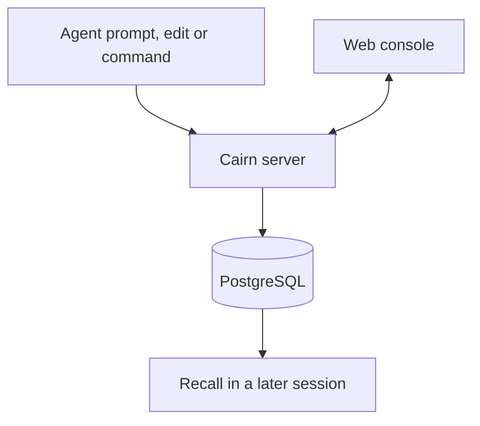

# Shared memory for coding agents

```mermaid
flowchart TD
  Work["Agent prompt, edit or command"] --> Server["Cairn server"]
  Server --> DB[("PostgreSQL")]
  DB --> Recall["Recall in a later session"]
  Console["Web console"] <--> Server
```

Agent hooks capture work. Cairn stores memories and delivers relevant context to later sessions. People review and correct those records in the console.
